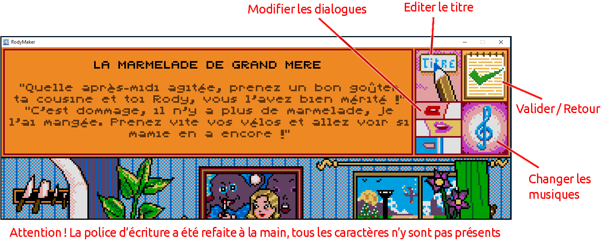
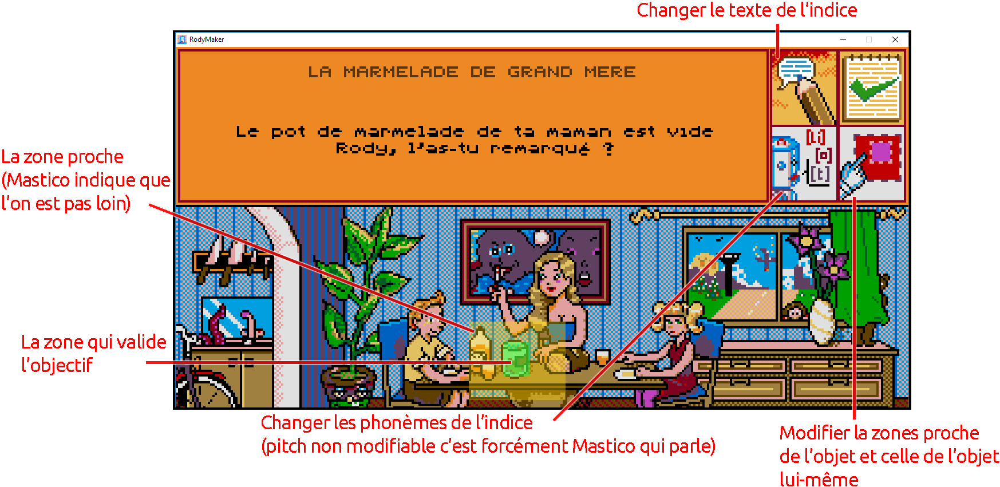

# Rody Maker — Créer et partager une histoire

Guide de la version en préparation, relu le **10 septembre 2026**. Les fonctions
récentes restent à vérifier dans une version navigateur publiée. Les anciennes
vidéos et captures ne décrivent plus la sauvegarde ni le nouvel atelier vocal.
Le [document de conception](GAME_DESIGN.md) explique le produit et distingue
les règles de création et de sauvegarde de cette version.

## Commencer

- **Nouveau :** dans la collection, choisissez la création d'histoire, entrez un
  titre et, si vous le souhaitez, importez une couverture. Une scène est créée.
- **Modifier un original :** sélectionnez sa couverture, puis **Dupliquer**.
  La copie devient **Mon histoire**, votre seul espace personnel de création.
- **Reprendre :** sélectionnez **Mon histoire**, puis **Éditer**.
- **Importer :** utilisez **Importer** et choisissez un fichier `.rody.json`.
  Les anciens dossiers de jeu ne sont pas le format d'import actuel.

Créer, dupliquer ou importer remplace **Mon histoire**. Si vous l'avez modifiée,
choisissez **Enregistrer**, **Ne pas enregistrer** ou **Annuler**. Enregistrer
télécharge d'abord l'histoire actuelle ; Annuler la garde ouverte. Un import
annulé ou illisible conserve aussi votre travail. Jouer un original ne le remplace
pas, et le pinceau du jeu protège les originaux de la même manière que Dupliquer.

## Se repérer dans l'éditeur

Les vignettes permettent de choisir une scène. L'image sélectionnée occupe
l'aperçu principal, avec les outils à droite.

| Outil | Usage actuel |
|---|---|
| **INTRO** | Titre de scène, textes, dialogues et musique |
| **IMG** | Image principale et images d'animation |
| **Objets** | Indices et zones cliquables |
| **Disquette / Enregistrer** | Télécharger l'histoire complète |
| **Test** | Jouer le brouillon actuel sans l'enregistrer |
| **Annuler les modifications** | Restaurer toute l'histoire à son point de reprise |

L'image de titre est distincte de la couverture du menu. Elle n'a pas de dialogue
ni d'objectif à éditer. Les vignettes proposent aussi l'ajout de scènes ; les
règles d'ajout/suppression actuelles sont encore irrégulières. La promesse de
l'ancien tutoriel « de 16 à 29 scènes » ne décrit pas une limite fiable aujourd'hui.

## Images

Préparez les images dans votre outil de dessin, puis importez-les avec **IMG**.
Utilisez **320 × 130** pour une scène, **320 × 200** pour le titre ou la couverture,
et la [palette Rody](bonus/paletteRody.png) pour prévoir les couleurs du résultat.
L'import ajuste les dimensions et les couleurs ; aucun nom de fichier spécial
n'est nécessaire.

L'image principale représente la scène au repos. Les images d'animation montrent
les personnages lorsqu'ils parlent. L'éditeur présente deux groupes de trois
images. Importez une image existante pour la remplacer, ou la prochaine position
vide pour ajouter une image. Les commandes de prévisualisation et **Retirer**
concernent l'image correspondante. Enregistrer garde cette séquence sans ajouter
de copies de l'image principale.

## Introduction, texte et musique

Dans **INTRO**, choisissez le titre, les dialogues ou la musique.

*Illustration historique : les pictogrammes aident à se repérer ; elle ne prouve
pas le comportement de la version actuelle.*

Les boutons **1**, **2**, **3** donnent accès aux trois répliques d'introduction.
Pour chacune, éditez séparément le texte affiché et la voix. L'interrupteur Mastico
choisit si Mastico s'anime ou si les images du décor accompagnent la réplique.
La police rétro ne contient pas tous les caractères : regardez le texte dans son
aperçu avant de finaliser la scène.

Pour la musique, **L1** choisit l'ouverture et **L2** la musique répétée.
Le bouton d'écoute permet de préécouter les pistes fournies.

## Écrire une voix

Ouvrez l'outil vocal depuis une réplique ou un indice. Le bouton **Voix** de la
collection ouvre le même atelier pour une utilisation indépendante.

1. Écrivez la phrase en français et écoutez sa proposition de prononciation.
2. Sélectionnez un mot qui sonne mal et ajustez sa prononciation dans le champ prévu.
3. Réécoutez le mot ou le passage dans son contexte. Les exemples de sons servent
   à essayer et insérer les sons de la voix rétro.
4. Réglez la hauteur de voix lorsqu'elle est disponible. Les indices restent dits
   par Mastico ; leur hauteur est fixe.
5. Choisissez **Utiliser ce dialogue** pour l'appliquer, ou **Annuler** pour revenir
   sans modifier la réplique. Le dialogue appliqué est immédiatement dans le
   brouillon ; Enregistrer le téléchargera avec toute l'histoire.

Les virgules créent une pause courte ; les points et la ponctuation de fin de phrase
une pause longue. Les espaces séparent les mots sans imposer une pause.
Les mots inventés peuvent nécessiter une correction. La conversion peut afficher
une erreur : écoutez et corrigez avant de valider.

Les phrases françaises enregistrées conservent leurs corrections pour la reprise.
Les anciennes répliques écrites directement en phonèmes restent éditables sans
inventer leur texte français. En mode indépendant, **Copier les phonèmes** copie
la partition sonore, pas un fichier audio ni l'ensemble du texte et des corrections.
La [référence vocale](SPEECH_ENGINE.md) détaille la notation pour les usages avancés.

## Dessiner un objectif

Dans **Objets**, choisissez l'objectif principal, **New Game Plus** ou **FromSoftware**.
Chacun possède un texte d'indice, une voix et deux rectangles.

1. Éditez le texte et la voix de l'indice.
2. Ouvrez le dessin des zones et faites glisser pour dessiner la zone proche.
3. Utilisez le bouton de zone pour passer à la cible exacte.
4. Dessinez cette cible à l'intérieur de la zone proche, puis terminez avec le bouton.
5. Revenez aux outils de la scène pour continuer ou tester. Le brouillon garde la paire complète.

Chaque objectif possède **une seule paire de zones**. Si vous quittez le dessin
avant de terminer la cible, la paire précédente reste en place. Le clic droit
n'ajoute pas de cible supplémentaire.

## Enregistrer, tester et reprendre

Les textes saisis et les modifications acceptées restent dans le même brouillon,
même en changeant de scène, en testant ou en allant jouer un original. L'atelier
vocal conserve son choix explicite **Utiliser ce dialogue / Annuler**.

- **Test** joue le contenu actuel. Revenir à l'éditeur retrouve votre scène de travail,
  même si vous avez progressé dans l'histoire pendant le test.
- **Enregistrer** télécharge un fichier `.rody.json` contenant toute l'histoire :
  scènes, images, textes et voix. Il reste disponible même sans modifications.
- **Annuler les modifications** demande confirmation puis restaure toute l'histoire,
  y compris les images et les scènes ajoutées/supprimées, à sa version initiale ou
  au dernier Enregistrer. Le bouton est désactivé lorsqu'il n'y a pas de changements.

**Téléchargement lancé** signifie que le navigateur a reçu la demande. Vérifiez que
vous avez gardé le fichier ; le jeu ne peut pas savoir si vous annulez ensuite son
enregistrement dans les commandes du navigateur ou du système. Un échec détecté
conserve le brouillon et son point de reprise.

Le navigateur conserve automatiquement **Mon histoire**, avec ses changements et
son point de reprise, pour la retrouver après rechargement. Cela ne remplace pas
le fichier téléchargé. **Modifications non enregistrées** signifie que vous avez
changé l'histoire depuis son point de reprise, même si le navigateur garde ce travail.

Une erreur de récupération laisse le travail ouvert et Enregistrer disponible.
**Réessayer** permet de relancer la récupération automatique. Une écriture
interrompue par une fermeture ou un plantage peut perdre les derniers changements.
Changer de navigateur ou d'appareil, ou effacer les données du site, ne transporte
pas votre espace de travail : utilisez le fichier `.rody.json` et **Importer**.
Ce même fichier permet de partager l'histoire avec un ami.

## Ressources et anciens supports

- [Palette PNG](bonus/paletteRody.png) et [palette ACT](bonus/paletteRody.ACT) pour votre outil de dessin.
- [Police Rody](bonus/Rody.ttf), recréée pixel par pixel, avec une couverture de caractères limitée.
- [Ancienne vidéo](https://www.youtube.com/watch?v=1vx8D2irVLI) : repère visuel historique,
  pas une procédure actuelle pour importer, enregistrer ou écrire une voix.
- [Ancien menu de scènes](tutorial-screenshots/01-hub-scenes.png),
  [ancien éditeur principal](tutorial-screenshots/02-editor-main.png),
  [trois répliques](tutorial-screenshots/04-three-speakers.png),
  [ancien panneau de dialogue](tutorial-screenshots/05-dialogue-edit.png),
  [musique](tutorial-screenshots/06-music-selection.png),
  [trois objectifs](tutorial-screenshots/07-object-slots.png),
  [pinceau](tutorial-screenshots/09-paintbrush-edit.png).
  Ces images sont conservées comme références historiques. Leurs annotations sur
  les dossiers de sauvegarde et l'ancien clavier vocal sont obsolètes.

Pour signaler un problème ou proposer une histoire, utilisez la
[page itch.io de la collection](https://lacrearthur.itch.io/rody-mastico-collection).
